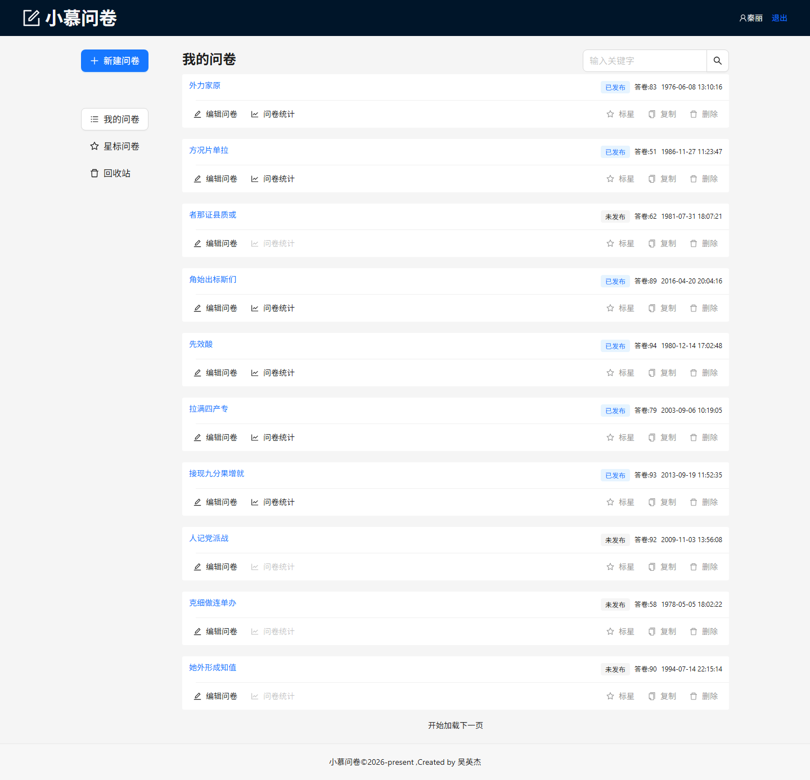
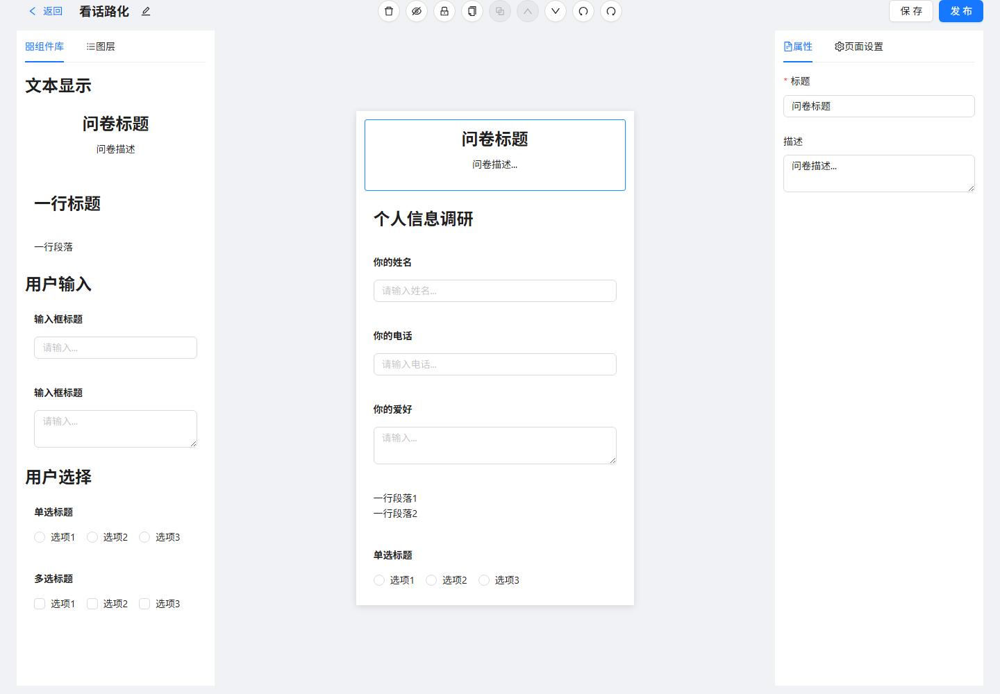
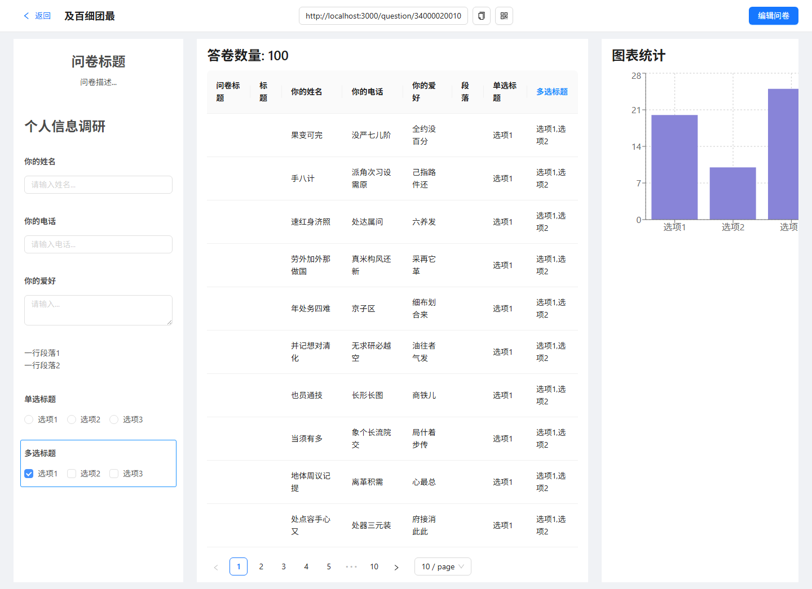
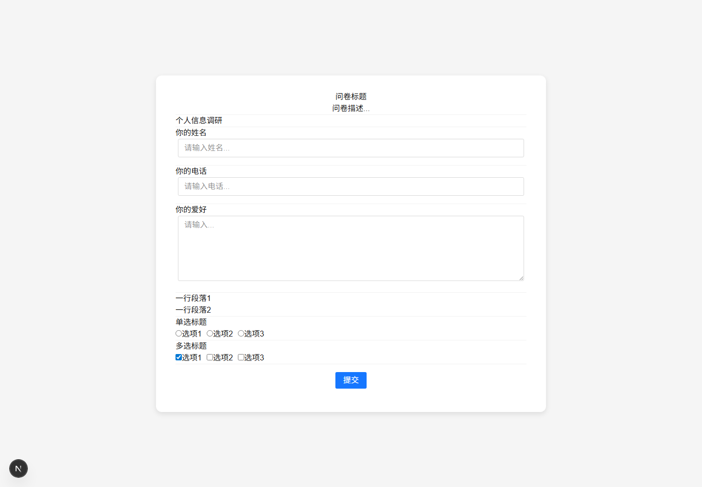

# AI Survey Builder 智能问卷编辑与分析平台

一个基于 React + TypeScript 的问卷编辑、填写与统计平台，包含管理后台、问卷填写端和 Mock 后端。

项目支持问卷创建、编辑、发布、填写和统计分析。管理后台提供配置化题型系统、画布编辑、属性面板、图层管理、拖拽排序、撤销重做、登录鉴权等能力；填写端用于用户填写问卷并提交答案；Mock 后端用于模拟用户、问卷、答卷和统计接口，方便前后端联调。

后续计划接入真实后端、数据库和 LLM Agent，将项目升级为支持 AI 生成问卷、AI 优化题目、AI 生成选项和 AI 统计分析报告的智能问卷平台。

## 技术栈

### 管理后台

- React
- TypeScript
- React Router
- Redux Toolkit
- redux-undo
- Ant Design
- Axios
- ahooks
- dnd-kit
- Recharts
- Sass
- CRACO

### 问卷填写端

- Next.js
- React
- TypeScript
- Sass
- Axios

### Mock 后端

- Node.js
- Koa
- koa-router
- Mock.js

## 主要功能

- 用户注册、登录、退出登录
- 登录状态恢复和路由守卫
- 问卷创建、复制、删除、星标、回收站
- 问卷编辑、保存和发布
- 配置化题型系统
- 支持标题、段落、输入框、文本域、单选、多选等题型
- 画布组件选中、隐藏、锁定
- 右侧属性面板动态编辑题型属性
- 图层管理
- 拖拽排序
- 复制、粘贴、删除组件
- 撤销、重做
- 问卷填写端
- 答卷统计和图表展示

## 项目结构

```text
survey-agent-platform
├─ wenjuan-fe
│  └─ react-program        # 管理后台
├─ wenjuan-client          # 问卷填写端
├─ wenjuan-mock            # Mock 后端
├─ README.md
└─ .gitignore
```

## 本地启动

### 方式一：一行命令启动完整项目

第一次启动前，先分别安装三个子项目依赖：

```bash
cd wenjuan-mock
npm install
```

```bash
cd wenjuan-fe/react-program
npm install
```

```bash
cd wenjuan-client
npm install
```

之后回到项目根目录，执行一行命令即可同时启动 Mock 后端、管理后台和问卷填写端：

```bash
cd D:\program
npm run dev
```

启动后访问：

```text
Mock 服务：http://localhost:3001
管理后台：http://localhost:8000
填写端：http://localhost:3000
```

停止项目时，在终端按 `Ctrl + C`。

管理后台启动完成后会自动打开浏览器访问 `http://localhost:8000`。

### 方式二：分别启动

#### 1. 启动 Mock 后端

```bash
cd wenjuan-mock
npm install
node index.js
```

Mock 服务地址：

```text
http://localhost:3001
```

#### 2. 启动管理后台

```bash
cd wenjuan-fe/react-program
npm install
npm start
```

管理后台地址：

```text
http://localhost:8000
```

#### 3. 启动问卷填写端

```bash
cd wenjuan-client
npm install
npm run dev
```

填写端地址：

```text
http://localhost:3000
```

## 主要页面

```text
首页：http://localhost:8000/
登录页：http://localhost:8000/login
问卷管理页：http://localhost:8000/manage/list
问卷编辑页：http://localhost:8000/question/edit/:id
问卷统计页：http://localhost:8000/question/stat/:id
问卷填写页：http://localhost:3000/question/:id
```

## 项目截图

### 问卷管理页



### 问卷编辑器



### 问卷统计页



### 问卷填写端



## 核心实现

### 1. 配置化题型系统

项目将每种问卷题型抽象成统一配置：

```ts
{
  title: string
  type: string
  Component: FC
  PropComponent: FC
  defaultProps: object
  StatComponent?: FC
}
```

编辑器通过组件的 `type` 查找对应题型配置，再动态渲染画布组件、右侧属性编辑组件和统计组件。新增题型时，只需要按照规范新增题型模块并注册到配置列表中，不需要大幅修改编辑器主体逻辑。

### 2. Redux 编辑器状态管理

编辑器核心状态是 `componentList`：

```ts
{
  selectedId: string
  componentList: ComponentInfoType[]
  copiedComponent: ComponentInfoType | null
}
```

问卷中的每个题目都会被抽象成一个组件数据，包含 `fe_id`、`type`、`title`、`props`、`isHidden`、`isLocked` 等字段。画布、属性面板、图层面板和工具栏都围绕同一份 Redux 状态协作。

### 3. 画布渲染与属性编辑

`EditCanvas` 遍历 `componentList`，根据组件 `type` 调用 `getComponentConfByType` 获取对应展示组件，并通过 `<Component {...props} />` 动态渲染到画布。

`ComponentProp` 根据当前选中的组件获取对应的 `PropComponent`，用于动态渲染右侧属性表单。用户修改属性后，属性面板通过 `onChange` 触发 Redux 更新组件 `props`，画布随状态变化实时重新渲染。

### 4. 拖拽排序

项目使用 `dnd-kit` 封装拖拽排序能力。画布组件和图层组件都可以通过拖拽调整顺序，拖拽结束后根据 `oldIndex` 和 `newIndex` 更新 Redux 中的 `componentList`。

### 5. 撤销重做

项目使用 `redux-undo` 管理编辑器历史状态，支持组件添加、删除、属性修改和排序后的撤销重做。对于选中组件、复制组件等不需要进入历史记录的操作，则通过过滤配置排除。

### 6. 登录状态与路由守卫

登录成功后，前端将 token 保存到 localStorage，并将用户信息保存到 Redux。页面刷新时，`useLoadUserData` 会根据 token 请求用户信息并恢复 Redux 登录状态。`useNavPage` 根据登录状态控制页面跳转，未登录用户访问管理页、编辑页和统计页时会被跳转到登录页。

### 7. Ajax 与 Mock 后端

前端通过 Axios 封装统一请求层，在请求拦截器中自动携带 token，在响应拦截器中统一处理接口返回格式和错误提示。Mock 后端基于 Koa + Mock.js 模拟用户、问卷、答卷和统计接口，方便前端开发和接口联调。

## 项目亮点

- 使用配置化方式管理问卷题型，降低新增题型的维护成本。
- 使用 Redux Toolkit 管理复杂编辑器状态，实现组件选中、属性修改、隐藏锁定、复制粘贴和拖拽排序。
- 使用 `redux-undo` 实现撤销重做，提升编辑器操作体验。
- 使用 `dnd-kit` 实现画布和图层拖拽排序。
- 使用 Axios 拦截器统一处理 token、错误提示和接口返回格式。
- 管理后台、填写端、Mock 后端分离，模拟真实前后端协作流程。
- 项目后续可自然升级为真实后端持久化和 AI Agent 问卷生成场景。

## 已解决的问题

### 退出登录后自动登录

项目曾出现退出登录后刷新页面又自动进入管理后台的问题。排查后发现，前端退出时虽然清空了 Redux 用户信息和 localStorage 中的 token，但恢复登录状态的逻辑仍然请求了 `/api/user/info`，而 Mock 后端没有校验 Authorization，导致前端重新写入用户信息。

解决方式：

- 前端在 `useLoadUserData` 中增加 token 判断，没有 token 时不再请求用户信息接口。
- Mock 后端在 `/api/user/info` 中判断 Authorization，没有 token 时返回未登录错误。
- 保留退出时清空 Redux、删除 token、跳转登录页的逻辑。

这个问题体现了登录态恢复、前端路由守卫和后端鉴权接口需要配合设计。

## 当前不足与后续规划

- 接入真实后端和数据库，实现问卷、答卷和统计数据持久化。
- 使用 JWT 完善登录鉴权、token 过期和 401 全局处理。
- 抽离管理端和填写端公共题型协议，减少重复维护。
- 使用 TypeScript 可辨识联合类型增强 `type` 与 `props` 的类型约束。
- 优化长问卷场景下的画布渲染性能。
- 接入 LLM，实现 AI 生成问卷、AI 优化题目、AI 生成选项和 AI 统计分析报告。
- 增加项目截图、部署地址和在线预览。
